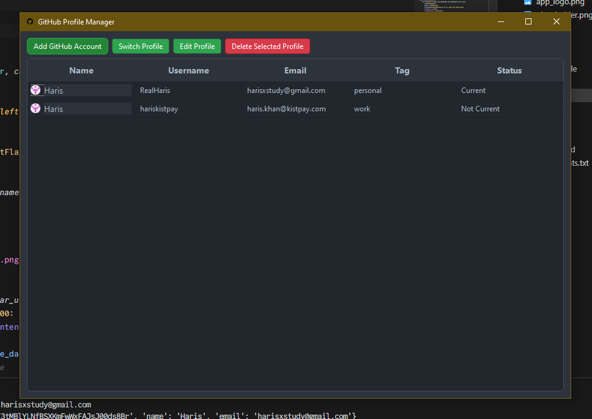
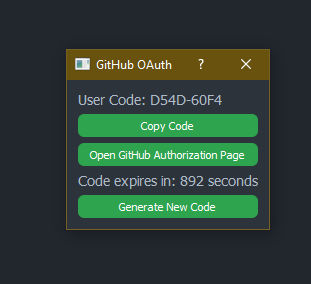

# Easy Git Switcher

[](LICENSE)

_Note: Currently available for **Windows**. Support for **Linux** and **macOS** is coming soon._

## Introduction

**Easy Git Switcher** is a Python-based GUI application that allows you to manage multiple GitHub profiles using OAuth authentication. Built with PyQt5, this tool enables you to switch between different GitHub accounts seamlessly. It securely stores your credentials using the system's keyring.

## Features

- **Add Multiple GitHub Accounts**: Authenticate with GitHub using OAuth and add multiple accounts.
- **Switch Between Profiles**: Easily switch between different GitHub profiles.
- **Manage Profiles**: Add and edit tags for each profile, display profile details (name, username, email), and see which profile is currently in use.
- **Load Existing Profiles**: Automatically load existing profiles from the Git credential manager.
- **Prevent Duplicates**: Avoid adding duplicate profiles.

## Prerequisites

- **Windows OS**
- **Python 3.10.14 or higher**
- **pip 24.2 or higher**

## Setup

### 1. Clone the Repository

```bash
git clone https://github.com/RealHaris/easy-git-switcher.git
cd easy-git-switcher
```

### 2. Install the Required Packages

You can install the required packages using the `requirements.txt` file:

```bash
pip install -r requirements.txt
```

Alternatively, you can run the `setup.py` script:

```bash
python setup.py
```

### 3. Set Up Environment Variables

The application requires a GitHub OAuth `CLIENT_ID` to authenticate with GitHub. You need to create a `.env` file in the root directory of the project and add your `CLIENT_ID`.

#### How to Obtain a GitHub OAuth CLIENT_ID

1. Go to [GitHub Developer Settings](https://github.com/settings/developers).
2. Click on **"New OAuth App"**.
3. Fill in the required details:
   - **Application name**: _Easy Git Switcher_ (or any name you prefer)
   - **Homepage URL**: `http://localhost`
   - **Authorization callback URL**: `http://localhost`
4. After creating the app, you will be provided with a **Client ID** and a **Client Secret**. Copy the **Client ID**.

#### Create the `.env` File

In the root directory of the project, create a file named `.env` and add the following line:

```
CLIENT_ID=your_github_client_id_here
```

Replace `your_github_client_id_here` with the **Client ID** you obtained from GitHub.

### 4. Run the Application

```bash
python app.py
```

## Building the Executable

If you wish to build an executable file for distribution, you can use **PyInstaller**:

you can install PyInstaller using pip:

```
pip install --force-reinstall --no-binary :all: pyinstaller
```

Then, run the following command:

```bash
pyinstaller --noconfirm --onefile --windowed --icon=assets\app_logo.ico --add-data "assets;assets" --add-data ".env;." --hidden-import "keyring.backends.Windows" --collect-all "keyring" --exclude-module "tkinter" --exclude-module "test" --name "EasyGitSwitcher" app.py
```

This will create a standalone executable in the `dist` directory.

## Usage

Once the application is running, you can:

- **Add a GitHub Account**:
  - Click on **"Add GitHub Account"**.
  - A dialog will appear with a user code and a link to GitHub's authorization page.
  - Copy the user code and open the authorization page.
  - Paste the user code when prompted and authorize the application.
  - The application will automatically detect when the authorization is complete.
- **Switch Profiles**:
  - Select a profile from the list.
  - Click **"Switch Profile"** to make it the current Git profile.
- **Edit Profiles**:
  - Select a profile and click **"Edit Profile"** to modify its name, email, or tag.
- **Delete Profiles**:
  - Select a profile and click **"Delete Selected Profile"** to remove it.

## Screenshots


_Main Interface_


_Adding a GitHub Account_

## Troubleshooting

- **Python Version**: Ensure you have Python 3.10.14 or higher installed.
- **pip Version**: Ensure you have pip 24.2 or higher. You can upgrade pip using:
  ```bash
  python -m pip install --upgrade pip
  ```
- **Environment Variables**: Make sure the `.env` file is correctly set up with your `CLIENT_ID`.
- **Dependencies**: All required dependencies are listed in `requirements.txt`. Ensure they are installed.

## Contributing

Contributions are welcome! Please open an issue or submit a pull request for any bugs or feature requests.

## License

This project is licensed under the MIT License - see the [LICENSE](LICENSE) file for details.

## Acknowledgments

- [PyQt5](https://www.riverbankcomputing.com/software/pyqt/intro)
- [GitHub API](https://docs.github.com/en/rest)
- [Keyring Library](https://pypi.org/project/keyring/)
- [PyInstaller](https://www.pyinstaller.org/)
- [dotenv](https://pypi.org/project/python-dotenv/)

---

_Note: Currently, Easy Git Switcher is available for **Windows**. Support for **Linux** and **macOS** is coming soon._

---
